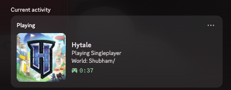
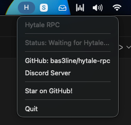

# Hytale Discord Rich Presence

Show your Hytale activity on Discord!

## Download

| Platform | Download | File |
|----------|----------|------|
| macOS | [Download](https://github.com/butterdogceo/hytale-rpc/releases/download/latest/HytaleRPC.dmg) | `HytaleRPC.dmg` |
| Windows | [Download](https://github.com/butterdogceo/hytale-rpc/releases/download/latest/HytaleRPC.exe) | `HytaleRPC.exe` |
| Linux | [Download](https://github.com/butterdogceo/hytale-rpc/releases/download/latest/HytaleRPC) | `HytaleRPC` |

## How to Use

### macOS
1. Download and open `HytaleRPC.dmg`
2. Drag the app to Applications
3. Open it - look for "H" in your menu bar
4. Play Hytale - your status shows on Discord!

### Windows
1. Download and run `HytaleRPC.exe`
2. Look for the icon in your system tray
3. Play Hytale - your status shows on Discord!

### Linux
1. Download `HytaleRPC`
2. Make it executable: `chmod +x HytaleRPC`
3. Run it: `./HytaleRPC`
4. Play Hytale - your status shows on Discord!

## What It Shows

- In Main Menu
- Playing Singleplayer (with world name)
- Playing Multiplayer (with server)
- Time played

## Auto-Start (Optional)

**macOS:** System Settings → Login Items → Add the app

**Windows:** Press `Win+R`, type `shell:startup`, paste the exe there

**Linux:** Add to your desktop environment's startup applications or create a systemd user service

## Support

- Issues: [Open an issue](https://github.com/bas3line/hytale-rpc/issues)
- Email: social@ykira.com

## Links

[ GitHub](https://github.com/bas3line/hytale-rpc) · [ Discord Server](https://discord.gg/D5S6dh9Ww9)

## License

MIT
